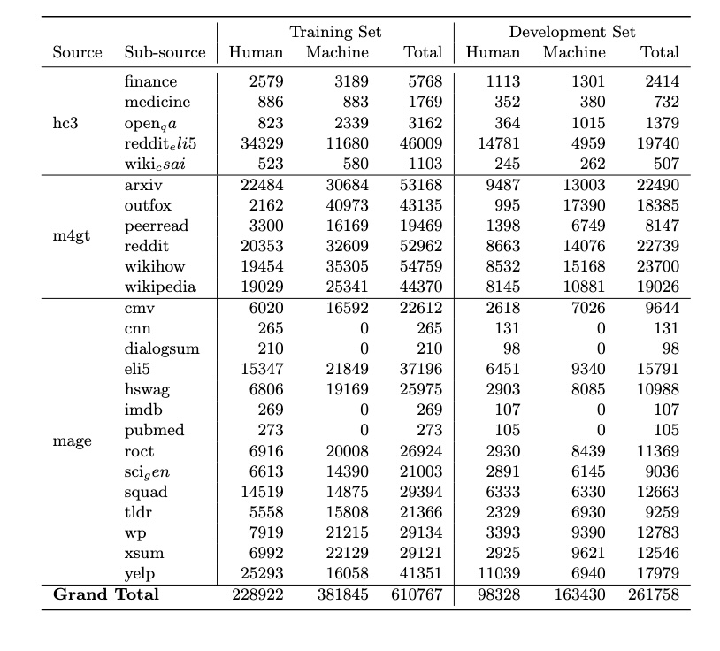
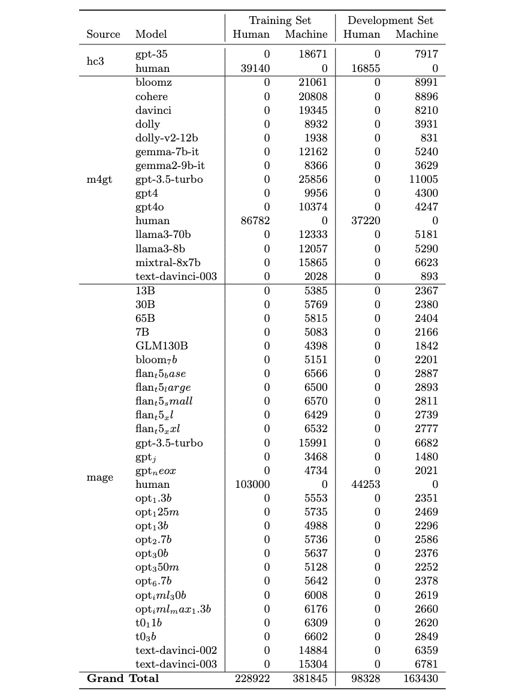
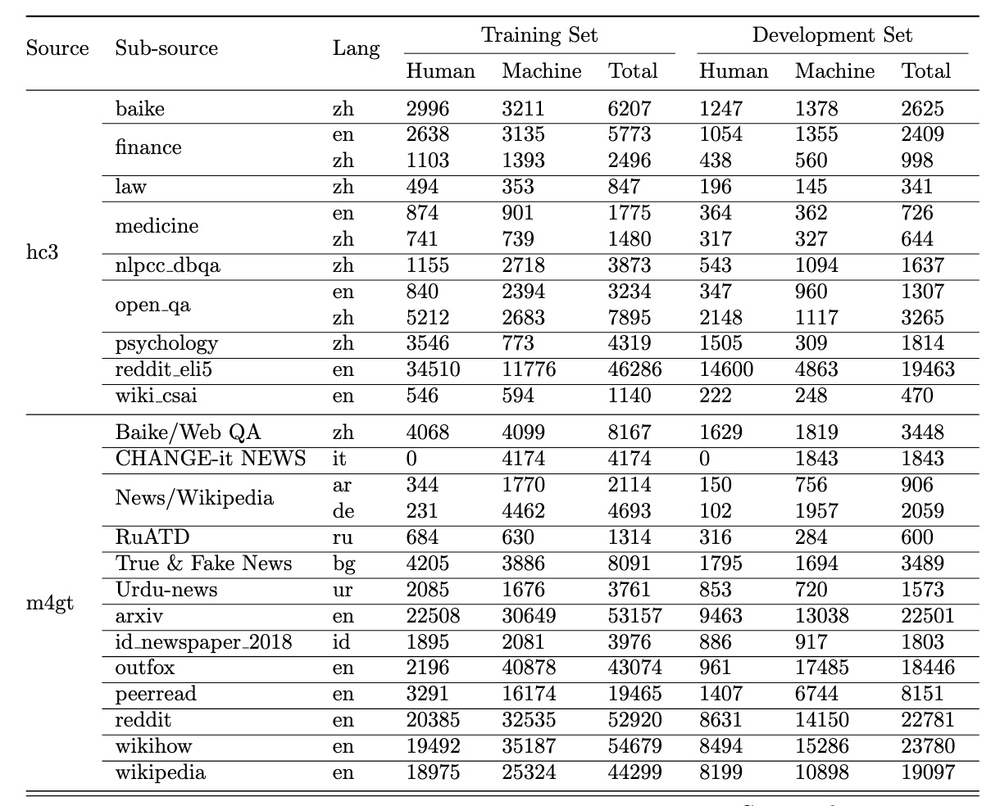
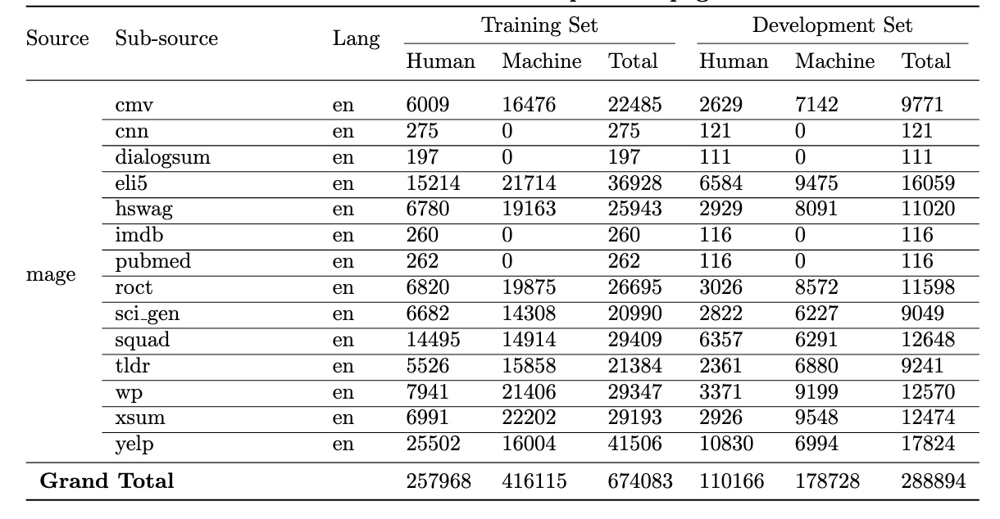

# Task 1: Binary Multilingual Machine-Generated Text Detection

[](https://raw.githubusercontent.com/mbzuai-nlp/SemEval2024-task8/subtask_A_and_B/LICENSE)

<p align="left" float="left">
  
</p>


[News](#news) | [Competition](#competition) | [Results](#results) | [Dataset](#dataset) | [Important Dates](#important_dates) | [Data Format](#data_format) | [Evaluation Metrics](#scorer_and_official_evaluation_metrics) | [Baselines](#baselines) | [Organizers](#organizers) | [Contacts](#contacts)

Large language models (LLMs) are becoming mainstream and easily accessible, ushering in an explosion of machine-generated content over various channels, such as news, social media, question-answering forums, educational, and even academic contexts. Recent LLMs, such as GPT-4o, Claude3.5 and Gemini1.5-pro, generate remarkably fluent responses to a wide variety of user queries. The articulate nature of such generated texts makes LLMs attractive for replacing human labor in many scenarios. However, this has also resulted in concerns regarding their potential misuse, such as spreading misinformation and causing disruptions in the education system. Since humans perform only slightly better than chance when classifying machine-generated vs. human-written text, there is a need to develop automatic systems to identify machine-generated text with the goal of mitigating its potential misuse. 

In the COLING Workshop on MGT Detection Task 1, we adopt a straightforward binary problem formulation: determining whether a given text is generated by a machine or authored by a human. This is the continuation and improvement of the [SemEval Shared Task 8 (subtask A)](https://arxiv.org/abs/2404.14183). We aim to refresh training and testing data with generations from novel LLMs and include new languages.

There are two subtasks:
- Subtask A: English-only MGT detection.
- Subtask B: Multilingual MGT detection.

## NEWS 

### 6 Nov 2024: Results for the Test Phase are Released
[Results](#results)

### 31 Oct 2024: Update Test Sets
**Updated Test Sets!**
Some of our participants provide valuable feedback to us for the test sets. To improve the quality of test sets, we removed some rows, while kept the original ids.
**Please Check the Updated Test Sets** from [Google Drive](https://drive.google.com/drive/folders/1Mz8vTnqi7truGrc05v6kWaod6mEK7Enj?usp=sharing) 

You may see score=-1 when you submit your results to Codabench. This is normal. You will see the accuracy and rank by the next mintues of evaluation phase. The last submission counts.

### 29 Oct 2024
We are excited to release our test sets for both English and Multilingual Track. Download Test Set from [Google Drive](https://drive.google.com/drive/folders/1Mz8vTnqi7truGrc05v6kWaod6mEK7Enj?usp=sharing) 

**Note that** submit by the original text order, **human label = 0, machine label = 1**. 
Looking forward to your excellent detection results!

### 21 Oct 2024
We extend **test set release time to Oct 29**, 2024

### 27 Aug 2024

We have released our training and dev set.

## Competition

[The competition id held on Codabench](https://www.codabench.org/competitions/3734/#/participate-tab)

## Official Results
[Official results for the test phase](https://docs.google.com/spreadsheets/d/1Wmxpi3ipYURuYHeLWFhCvKrpL55pquvF6Nr1CXwYNe4/edit?gid=0#gid=0)

## Dataset
**Download the training and dev sets** by [Google Drive](https://drive.google.com/drive/folders/1Mz8vTnqi7truGrc05v6kWaod6mEK7Enj?usp=sharing) or by huggingface ([English](https://huggingface.co/datasets/Jinyan1/COLING_2025_MGT_en) and [Multilingual](https://huggingface.co/datasets/Jinyan1/COLING_2025_MGT_multingual)).

#### English:
<p align="center"> </p>
<p align="center"> </p>

#### Multilingual:
<p align="center"> </p>
<p align="center"> </p>

## <a name="important_dates"></a>Important Dates
All dates are AoE.

- 27th August, 2024: Training/dev set release
- ~~20th October~~ (extended to 29th Oct), 2024: Test set release and evaluation phase starts
- ~~25th October~~ (extended to 2dn Nov), 2024: Evaluation phase closes
- ~~28th October~~ (extended to 5th Nov), 2024: Leaderboard to be public
- 15th November, 2024: System description paper submission

## <a name="data_format"></a>Prediction File Format and Format Checkers

A prediction file must be one single JSONL file for all texts. The entry for each text must include the fields "id" and "label".  

The format checkers verify that your prediction file complies with the expected format. They are located in the ```format_checker``` module.

```python
python3 format_checker.py --prediction_file_path=<path_to_your_results_files> 
```

Note that format checkers can not verify whether the prediction file you submit contains predictions for all test instances because it does not have an access to the test file.

## <a name="scorer_and_official_evaluation_metrics"></a>Scorer and Official Evaluation Metrics

The scorers for the subtasks are located in the ```scorer``` modules.
The scorer will report the official evaluation metric and other metrics for a given prediction file.

The **official evaluation metric** is **macro f1-score**. However, the scorer also reports accuracy and micro-F1. 

The following command runs the scorer:
```python
python3 scorer.py --gold_file_path=<path_to_gold_labels> --prediction_file_path=<path_to_your_results_file> 
```

## <a name="baselines"></a>Baselines

Running the Transformer baseline:
 ```
python3 baseline.py --train_file_path <path_to_train_file> --dev_file_path <path_to_development_file> --test_file_path <path_to_test_file> --prediction_file_path <path_to_save_predictions> --model <path_to_model>
 ```

The result for the English track using **RoBERTa is 81.63**.

The result for the multilingual track using **XLM-R is 65.46**.

## Organizers

- Preslav Nakov, Mohamed bin Zayed University of Artificial Intelligence, UAE 
- Iryna Gurevych, Mohamed bin Zayed University of Artificial Intelligence, UAE; Technical University of Darmstadt, Germany
- Nizar Habash, New York University Abu Dhabi, UAE
- Alham Fikri Aji, Mohamed bin Zayed University of Artificial Intelligence, UAE
- Yuxia Wang, Mohamed bin Zayed University of Artificial Intelligence, UAE
- Artem Shelmanov, Mohamed bin Zayed University of Artificial Intelligence, UAE
- Ekaterina Artemova, Toloka AI, Netherlands
- Osama Mohammed Afzal, Mohamed bin Zayed University of Artificial Intelligence, UAE
- Jonibek Mansurov, Mohamed bin Zayed University of Artificial Intelligence, UAE
- Zhuohan Xie, Mohamed bin Zayed University of Artificial Intelligence, UAE
- Jinyan Su, Cornell University, USA
- Akim Tsvigun, Nebius AI, Netherlands
- Giovanni Puccetti, Institute of Information Science and Technology “A. Faedo”, Italy
- Rui Xing, Mohamed bin Zayed University of Artificial Intelligence, UAE
- Tarek Mahmoud, Mohamed bin Zayed University of Artificial Intelligence, UAE
- Jiahui Geng, Mohamed bin Zayed University of Artificial Intelligence, UAE
- Masahiro Kaneko, Mohamed bin Zayed University of Artificial Intelligence, UAE
- Ryuto Koike, Tokyo Institute of Technology, Japan
- Fahad Shamshad, Mohamed bin Zayed University of Artificial Intelligence, UAE


## Contacts

Website: [https://genai-content-detection.gitlab.io](https://genai-content-detection.gitlab.io)  
Email: genai-content-detection@googlegroups.com
